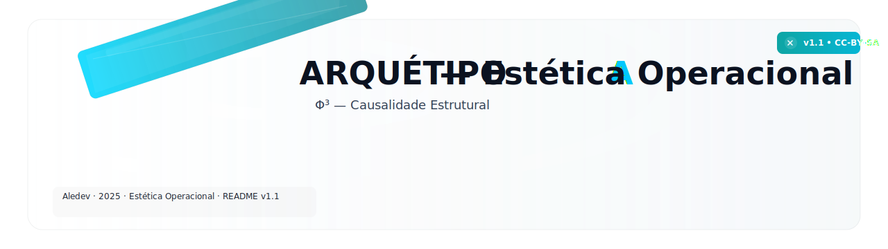
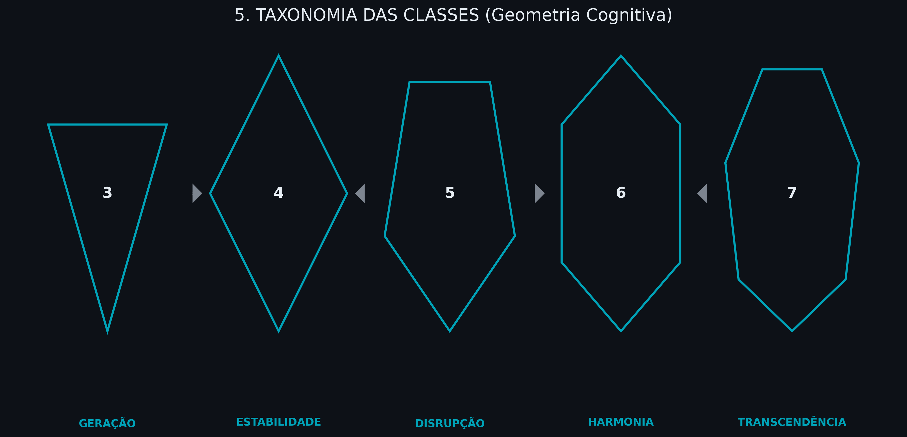
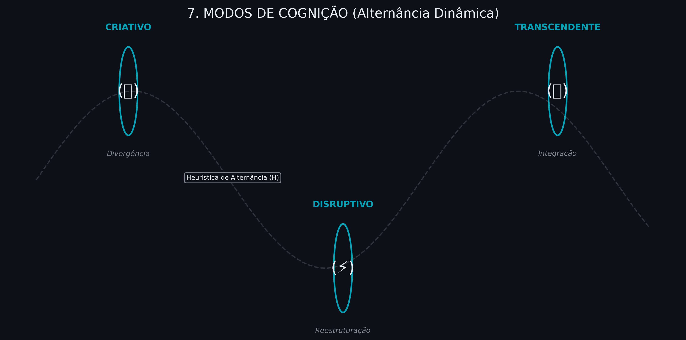
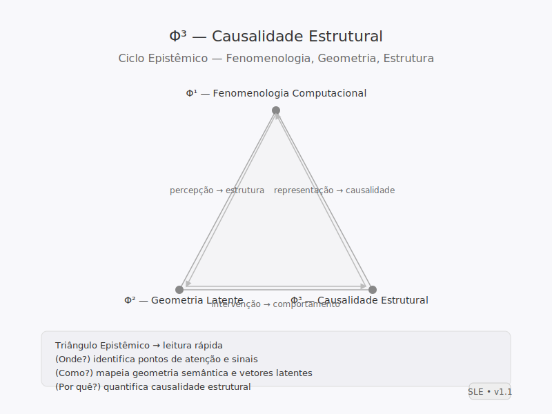
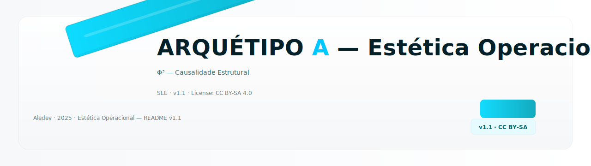

[](https://opensource.org/licenses/MIT)
[]()
[]()
[]()
[]()

> _“Entre forma e função, a cognição se operacionaliza.” — Aledev_

---

<p align="center">
  
</p>

---
## 📚 **ÍNDICE**

[](#-1-introdução)
[](#-2-conceito)
[](#-3-objetivo)

[](#-4-arquitetura-do-arquétipo-a)
[](#-5-taxonomia-das-classes)
[](#-6-formalização-algébrica)

[](#-7-modo-de-cognição--cinto-de-ciclos)
[](#-8-imagens--visualizações)
[](#-9-créditos--licença)

---

## 🪞 **1. INTRODUÇÃO**

O **Arquétipo A** é um **framework de cognição estética** que unifica estrutura formal, semântica e comportamento em um modelo operacional.  
Ele descreve como entidades cognitivas — humanas ou artificiais — **organizam e executam pensamento** através de ciclos formais e campos semânticos parametrizados.

> O Arquétipo A fornece um modelo algébrico para descrever processos mentais, estéticos e simbólicos sob uma lógica de operação.

Este framework surge da convergência entre:
- **Design semântico** — estruturação do sentido.  
- **Heurística cognitiva** — modelagem de padrões de pensamento.  
- **Arquitetura simbólica** — abstração geométrica de funções cognitivas.

---

## 💡 **2. CONCEITO**

Cada Arquétipo A é definido como uma **unidade de cognição executável**, composta por quatro eixos fundamentais:

| Componente | Símbolo | Descrição |
|:--|:--:|:--|
| Estrutura formal | 𝜙 | Define a identidade e a forma simbólica do sistema. |
| Ciclos operatórios | 𝒪₁...𝒪ₙ | Sequências de ação cognitiva. |
| Vetores tensionais | 𝜃 | Parâmetros de modulação e ajuste. |
| Campo semântico | Ω | Contexto de referência e memória associada. |

> O arquétipo opera como um sistema adaptativo de raciocínio configurável.

---

## 🧭 **3. OBJETIVO**

Fornecer uma base formal e interpretável para representar **processos de pensamento e criação** dentro de um modelo cognitivo universal,  
permitindo a integração entre raciocínio humano, simbólico e computacional.

Metas principais:
- Descrever estruturas cognitivas por meio de **modelos algébricos interpretáveis**.  
- Estabelecer **mecanismos de alternância semântica** baseados em ciclos operatórios.  
- Facilitar a **execução semântica** de ideias em sistemas simbólicos, heurísticos e híbridos.

---

## ⚙️ **4. ARQUITETURA DO ARQUÉTIPO A**

Cada instância do Arquétipo A é estruturada em um pacote YAML/JSON que define parâmetros, operadores e vínculos semânticos.

|Elemento|Descrição|
|--|--|
|`identidade`|Nome simbólico, domínio e classe (𝜙)|
|`HDSA`|Âncoras semânticas de alta densidade|
|`ABC`|Grafo de traits comportamentais|
|`Ciclo C`|Sequência de operadores cognitivos (𝒪₁…𝒪ₙ)|
|`Tensionadores T`|Sliders paramétricos (𝜃₁…𝜃ₙ)|
|`metadata`|Créditos, versão e rastreabilidade|

> Essa estrutura permite interoperabilidade entre sistemas cognitivos modulares e modelos algébricos descritivos.
---
[](https://colab.research.google.com/github/aleeepassarelli/archetype-a/blob/main/notebooks/Demo_Psicologo.ipynb)

---

## 🔺 **5. TAXONOMIA DAS CLASSES**

|Classe|Aridade|Propósito|Exemplo|Dimensão ABC|
|:--:|:--:|:--|:--|:--|
|3|Triângulo|Geração|Dialética, Processo Criativo|Criatividade ↔ Variedade|
|4|Quadrado|Estabilidade|PDCA, QMS|Pragmatismo ↔ Precisão|
|5|Pentágono|Disrupção|Design Thinking, Método Científico|Inovação ↔ Audácia|
|6|Hexágono|Harmonia|Seis Chapéus, Decisão Ética|Respeito ↔ Altruísmo|
|7|Heptágono|Transcendência|Modelos Reflexivos, Meditação|Sabedoria ↔ Inspiração|

> A forma geométrica define o tipo e o alcance do processo cognitivo modelado.
---


---

## 🧮 **6. FORMALIZAÇÃO ALGÉBRICA**

O Arquétipo A pode ser representado pela função:

\[
\mathcal{A} = f(\Phi, \mathcal{O}, \Theta, \Omega)
\]

Onde:

|Símbolo|Definição|
|:--:|:--|
| \( \Phi \) | Identidade e domínio semântico |
| \( \mathcal{O} = \{O_1, O_2, …, O_n\} \) | Operadores cognitivos (etapas do raciocínio) |
| \( \Theta \) | Vetores tensionais (parâmetros de modulação) |
| \( \Omega \) | Campo contextual e memória associada |

Exemplos de operadores cognitivos:

\[
B = \text{bifurcate}(\Phi), \quad W = \text{witness}(\Phi)
\]
\[
R = \text{resonate}(\Phi, \Theta), \quad T = \text{transform}(\Omega)
\]

> A função cognitiva emerge da interação dinâmica entre estrutura, operação e campo.

---

## 🧠 **7. MODO DE COGNIÇÃO — CINTO DE CICLOS**

O **Cinto de Ciclos** é o subsistema que regula a transição entre modos de raciocínio.  
Ele permite alternar entre padrões cognitivos distintos conforme a densidade e polaridade do campo semântico ativo.

|Modo|Símbolo|Tipo de Cognição|Aplicação|
|--|:--:|--|--|
|Criativo|🜂|Geração divergente|Ideação, composição, síntese conceitual|
|Disruptivo|⚡|Reestruturação|Inovação, crítica, reformulação de modelos|
|Transcendente|🔮|Integração|Síntese simbólica, insight, coesão de sistemas|

> O sistema ajusta sua operação cognitiva de forma contextual, mantendo coerência entre intenção e forma.
---


---

## 🌈 **8. IMAGENS & VISUALIZAÇÕES**

> Espaço reservado para diagramas e artefatos de referência visual.

```

assets/
├── banner_archetypeA.png
├── diagram_cycleC.png
├── class_taxonomy.png
└── cognition_modes.png

```

Exemplo de diagrama:
---

<p align="center">
  
</p>

---
## 📜 **9. CRÉDITOS & LICENÇA**

**Autor:** [Aledev](https://github.com/aleeepassarelli)  
**Licença:** [MIT](https://creativecommons.org/licenses/mit/)  
**Repositório:** [github.com/Aledev/Archetype-A](https://github.com/aleeepassarelli/archetypeA)

> “Entre a estrutura e o caos, há sempre uma forma que pensa.”  
> — *Manifesto do Arquétipo A · Estética Operacional*


<p align="center">
  
</p>


